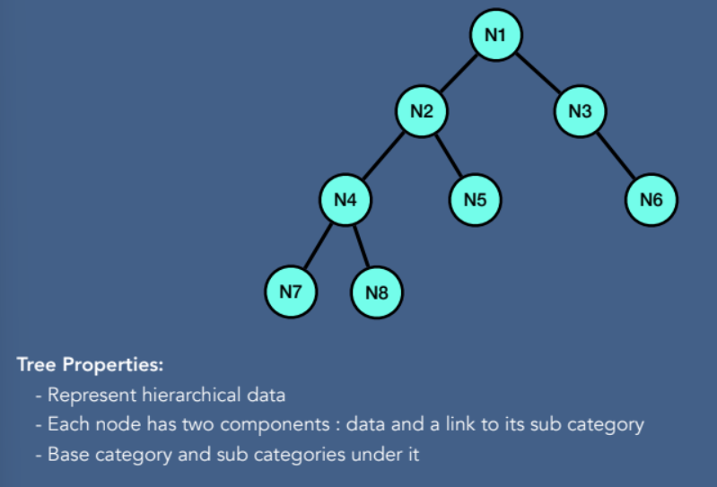
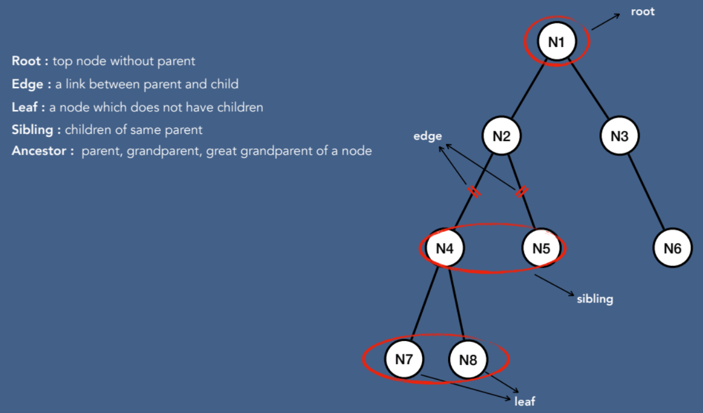

# Tree

#### 트리 구조 및 속성 

#### 트리 용어
- Root : top node without parent
- Edge : a link between parent and child
- Leaf : a node which does not have children
- Sibling : children of same parent
- Ancestor :  parent, grandparent, great grandparent of a node
- Depth of node :  a length of the path from root to node
- Height of node :  a length of the path from the node to the deepest node 
- Depth of tree : depth of root node
- Height of tree : height of root node

#### Binary Tree
